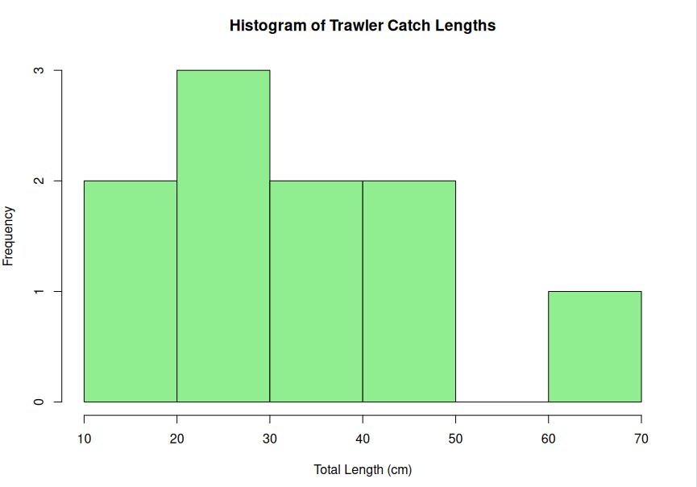
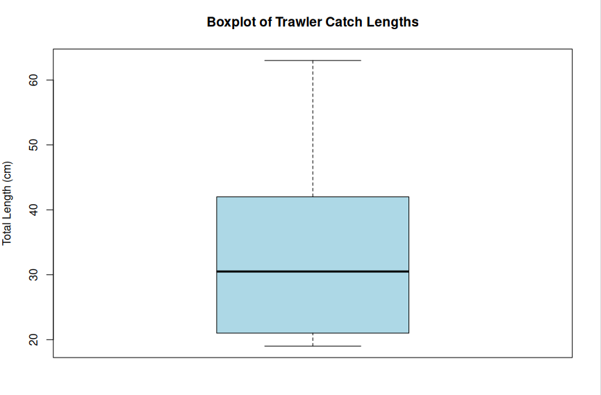

# Question 4
## Part A
```r
# HW 3 Question 4
print("QUESTION 4")

# A) Center: Mean, Median, Mode

# Data
data <- c(24, 26, 19, 63, 21, 20, 38, 35, 42, 47)

# Mean + median
mean <- mean(data)
median <- median(data)

# Mode 
mode <- function(x) {
  uniqv <- unique(x)              
  tabulated <- tabulate(match(x, uniqv))
  max_count <- max(tabulated)
  modes <- uniqv[tabulated == max_count] 
  return(modes)
}

checkModeFrequency <- function(mode_table, data) {
  if (all(dim(mode_table) == dim(data))) {
    print("Every value in the dataset appears equally frequently, so each value is a mode.")
  } 
}

mode = mode(data)

print("(A) Center: Mean, Median, Mode")
print(mean)
print(median)
print(mode)
checkModeFrequency(mode, data)
```


## Part B
```r
# B) Spread: Range, IQR, variance, and standard deviation

# Range
range = range(data)
range_size = range[2] - range[1]

# IQR 
findIQR <- function(data) {
  data <- sort(data)
  n <- length(data)
  
  if(n %% 2 == 0) { # Even num of elements
    lower_half <- data[1:(n / 2)]
    upper_half <- data[(n / 2 + 1):n]
    Q1 <- median(lower_half)
    Q3 <- median(upper_half)
  } else {        # Odd num of elements
    lower_half <- data[1:(n %% 2)]
    upper_half <- data[(n %% 2 + 2):n]
    Q1 <- median(lower_half)
    Q3 <- median(upper_half)
  }
  
  IQR <- Q3 - Q1
  return(IQR)
}
IQR = findIQR(data)

# Var and sd
variance <- var(data)
sd <- sd(data)

print("(B) Spread: Range (and range size), IQR, variance, and standard deviation")
print(range)
print(range_size)
print(IQR)
print(variance)
print(sd)
```


## Part C
```r
print("(C) Which stats to identify the center and the spread of this distribution?")
print("The median are more useful for identifying the center if the distribution is skewed.")
print("For spread, IQR is useful for skewed data, and variance/standard deviation help capture the overall spread.")
```


## Part D
```r
print("(D) Boxplot and histogram with comments on graphs")

# Boxplot
boxplot(data, main="Boxplot of Trawler Catch Lengths", 
        ylab="Total Length (cm)", col="lightblue", 
        names=c("Catch Data"))
# shows the distribution of the total lengths of the catch, with the median marked by the line inside the box.
# large gap between end of box Q3 and Q4 indicate right/positive skew 

# Histogram
hist(data, main="Histogram of Trawler Catch Lengths", 
     xlab="Total Length (cm)", col="lightgreen", 
     breaks=5)
# shows how the total lengths are distributed across different intervals, allowing us to observe patterns like skewness.
# once again indication of slight right skew
```




## Part E
```r
# e) Estimate the true mean length of a catch with a 95% confidence interval

# Calculate the confidence interval
n <- length(data)
se <- sd(data) / sqrt(n)  # Standard Error
error_margin <- qt(0.975, df=n-1) * se  # Margin of error for 95% confidence

lower_bound <- mean - error_margin
upper_bound <- mean + error_margin

# Output the confidence interval
print("(E) 95% Confidence Interval for the Mean Length")
print("Lower bound, upper bound")
print(lower_bound)
print(upper_bound)
```
